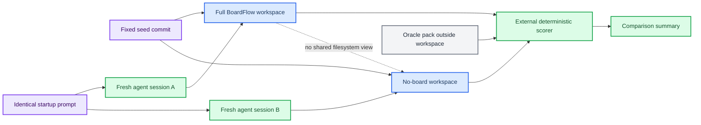
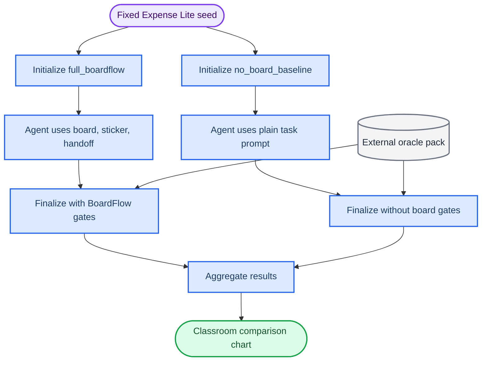
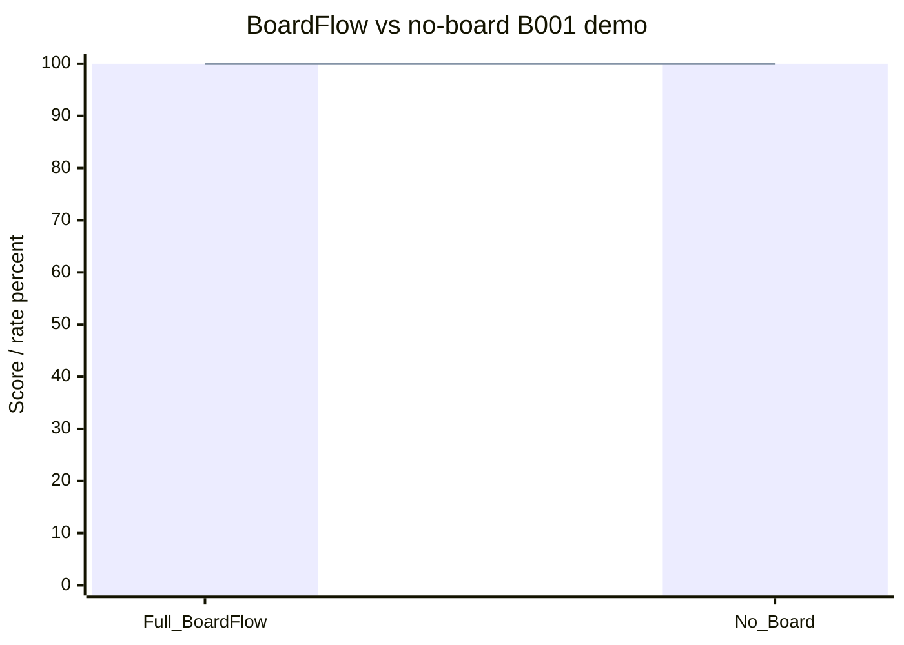

# Classroom comparison demo starter

_How to run a classroom demo comparing Full BoardFlow against a no-board baseline on the same Expense Lite task._

---

## Goal

Run the same benchmark task twice:

| Run | Condition | What the agent sees | What we compare |
| --- | --- | --- | --- |
| A | `full_boardflow` | BoardFlow files, taskboard, assigned sticker, handoff requirement, refresh context | Structured workflow, traceability, scope control, evidence |
| B | `no_board_baseline` | Same code seed and external task prompt, without BoardFlow files | Raw agent performance without repo-local coordination |

Use the same target, task, seed, oracle, model, and time budget. The only intended variable is whether the BoardFlow workflow exists.

> For a short classroom demo, use `B001 Date parser`. It is small enough to finish live, and it already has a visible failing test in the seed. For a stronger research demo, continue into `B002` because handoff and state inheritance become more visible in the second task.

## Recommended classroom format

Use manual mode first. It is easier to explain and less likely to fail because of CLI permission prompts.

1. Initialize both workspaces.
2. Show that both start from the same failing parser test.
3. Run one agent session in the `full_boardflow` workspace.
4. Run the same model in the `no_board_baseline` workspace.
5. Resume the runner for both.
6. Aggregate results and show the comparison table/diagram.

## Workspace isolation and contamination control

The two workspaces are supposed to be different directories. That is not a confound. The controlled part is that both are cloned from the same fixed seed and receive the same startup prompt. The treatment is the presence or absence of BoardFlow files.

For a fair comparison:

- Never run an agent from the BoardFlowBench root, `/tmp`, or a parent directory that contains both runs.
- Never pass both workspace paths through the prompt, inherited environment variables, shell history, `.claude` project context, or `--add-dir`.
- Use a fresh stateless agent session per run. Do not reuse a chat that has seen the other condition.
- Keep oracle and results directories outside both workspaces, and do not reveal those paths to the agent.
- Prefer sequential runs with randomized order for a live class. Parallel runs are acceptable only when each process is OS-sandboxed to its own workspace.
- For research-grade results, run multiple pairs and counterbalance order.



## Preconditions

Run these from the BoardFlowBench repository root:

```bash
pwd
git status --short
git -C ../ExpenseLiteBenchDemo rev-parse HEAD
git -C ../ExpenseLiteBenchDemo status --short
git -C ../ExpenseLiteBenchOracles rev-parse HEAD
git -C ../ExpenseLiteBenchOracles status --short
```

Expected fixed commits:

| Repository | Expected commit |
| --- | --- |
| `../ExpenseLiteBenchDemo` | `30ce6f0d76e2338e56d599fd2beb6fe954b96452` |
| `../ExpenseLiteBenchOracles` | `03a6bbcd0703587addc043cdfee54fb0be704702` |

Both sibling repositories should be clean before the demo.

## Initialize both conditions

```bash
export RUN_ID=$(date +%Y%m%d-%H%M%S)
export BFB_ROOT=/Users/chenyihao/mycode/BoardFlowBench
export RESULTS_ROOT=/tmp/boardflowbench-class-results-$RUN_ID
export FULL_ROOT=/tmp/boardflowbench-class-full-$RUN_ID
export NOBOARD_ROOT=/tmp/boardflowbench-class-noboard-$RUN_ID
export FULL_WS=$FULL_ROOT/workspace
export NOBOARD_WS=$NOBOARD_ROOT/workspace

cd "$BFB_ROOT"
rm -rf "$FULL_ROOT" "$NOBOARD_ROOT" "$RESULTS_ROOT"

PYTHONDONTWRITEBYTECODE=1 PYTHONPATH=. python3 scripts/run_scenario.py \
  --target expense_lite \
  --condition full_boardflow \
  --workspace "$FULL_WS" \
  --oracle-root ../ExpenseLiteBenchOracles \
  --results-dir "$RESULTS_ROOT" \
  --source-repo ../ExpenseLiteBenchDemo

PYTHONDONTWRITEBYTECODE=1 PYTHONPATH=. python3 scripts/run_scenario.py \
  --target expense_lite \
  --condition no_board_baseline \
  --workspace "$NOBOARD_WS" \
  --oracle-root ../ExpenseLiteBenchOracles \
  --results-dir "$RESULTS_ROOT" \
  --source-repo ../ExpenseLiteBenchDemo
```

Save the generated run paths:

```bash
export FULL_RUN=$(find "$RESULTS_ROOT" -maxdepth 1 -type d -name 'expense_lite-full_boardflow-*' | sort | tail -1)
export NOBOARD_RUN=$(find "$RESULTS_ROOT" -maxdepth 1 -type d -name 'expense_lite-no_board_baseline-*' | sort | tail -1)

echo "$FULL_RUN"
echo "$NOBOARD_RUN"
```

Both runs should stop at:

```text
"current_task": "B001"
"status": "awaiting_agent"
```

## Confirm the same starting failure

```bash
cd "$FULL_WS"
PYTHONDONTWRITEBYTECODE=1 PYTHONPATH=src python3 -m unittest discover -s tests -p 'test_parser.py'

cd "$NOBOARD_WS"
PYTHONDONTWRITEBYTECODE=1 PYTHONPATH=src python3 -m unittest discover -s tests -p 'test_parser.py'
```

Expected failure in both workspaces:

- `test_normalize_accepts_slash_date`
- `test_normalize_strips_whitespace_from_slash_date`

## Run agents manually

Use the same startup prompt in both workspaces. Do not add condition-specific instructions.

Do not launch agents from the setup shell if it still exports both `FULL_WS` and `NOBOARD_WS`. Open a fresh terminal per run, or unset peer-run variables before launching the agent. The agent process should know only its own current working directory.

Prompt file options:

- `docs/prompts/B001_FULL_BOARDFLOW_PROMPT.md`
- `docs/prompts/B001_NO_BOARD_BASELINE_PROMPT.md`

The code block under `Shared startup prompt` is intentionally identical in both files. Copy only that code block.

### Full BoardFlow workspace

Open an agent session in the BoardFlow workspace:

```bash
cd /tmp/boardflowbench-class-full-<RUN_ID>/workspace
unset FULL_WS NOBOARD_WS FULL_RUN NOBOARD_RUN RESULTS_ROOT FULL_ROOT NOBOARD_ROOT
claude
```

Paste the shared startup prompt. The expected useful changes are:

- `src/expense_lite/parser.py`
- `PROJECT_BOARD.md`
- `.board/tasks.yaml`
- `.board/handoffs/*.json`

### No-board workspace

Open a separate agent session in the no-board workspace:

```bash
cd /tmp/boardflowbench-class-noboard-<RUN_ID>/workspace
unset FULL_WS NOBOARD_WS FULL_RUN NOBOARD_RUN RESULTS_ROOT FULL_ROOT NOBOARD_ROOT
claude
```

Paste the exact same shared startup prompt. The expected useful change is `src/expense_lite/parser.py`. The prompt tells the agent not to create BoardFlow files when the workspace does not already contain them.

## Resume deterministic gates

After both agents finish:

```bash
cd "$BFB_ROOT"

PYTHONDONTWRITEBYTECODE=1 PYTHONPATH=. python3 scripts/run_scenario.py \
  --resume "$FULL_RUN/run.json"

PYTHONDONTWRITEBYTECODE=1 PYTHONPATH=. python3 scripts/run_scenario.py \
  --resume "$NOBOARD_RUN/run.json"
```

If a run fails, inspect its score:

```bash
find "$RESULTS_ROOT" -maxdepth 4 -type f | sort
```

For `full_boardflow`, a common failure is missing or malformed handoff. For `no_board_baseline`, a common failure is scope drift if the agent creates extra files.

## Aggregate and print comparison

```bash
PYTHONDONTWRITEBYTECODE=1 PYTHONPATH=. python3 scripts/aggregate_benchmark_results.py \
  --results-dir "$RESULTS_ROOT" \
  --output "$RESULTS_ROOT/summary.json"

python3 - <<'PY'
import json
from pathlib import Path

summary = json.loads(Path("/tmp/boardflowbench-class-results/summary.json").read_text())
print("| Condition | Runs | Stages | Pass rate | Scope drift | Handoff violations | Board violations | Hygiene violations |")
print("| --- | ---: | ---: | ---: | ---: | ---: | ---: | ---: |")
for condition, data in sorted(summary["by_condition"].items()):
    print(
        f"| {condition} | {data['run_count']} | {data['stage_count']} | "
        f"{data['task_pass_rate']:.2f} | {data['scope_drift_count']} | "
        f"{data['handoff_violation_count']} | {data['board_consistency_violation_count']} | "
        f"{data['hygiene_violation_count']} |"
    )
PY
```

## Comparison diagram



_XY chart template for the classroom slide. Replace the sample numbers after running `summary.json`:_



For B001, both conditions may pass because the task is intentionally small. The meaningful classroom contrast is usually not just correctness. Show these artifacts side by side:

| Evidence type | Full BoardFlow | No board baseline |
| --- | --- | --- |
| Current task visibility | `.board/assigned_task.yaml` | External prompt only |
| Backlog visibility | B001-B004 brief board | None |
| Structured handoff | Required and scored | Not required |
| Scope evidence | Scored against stage baseline | Scored against seed baseline |
| Acceptance evidence | External signed evidence plus workspace mirror | External evidence only |
| Next task activation | Automatic after gate pass | Checkpoint only |
| Teaching point | Workflow discipline and state inheritance | Raw coding performance |

## Optional automatic mode

Manual mode is best for teaching. Automatic mode is useful when you want repeatability across models.

For a B001-only classroom demo, run the CLI agent directly inside each initialized workspace, then resume the runner manually. Do not use `scripts/run_scenario.py --agent-command` for the shortest demo unless you want the runner to keep advancing into B002-B004.

Codex CLI direct run:

```bash
python3 - <<'PY'
from pathlib import Path

text = Path("docs/prompts/B001_FULL_BOARDFLOW_PROMPT.md").read_text(encoding="utf-8")
prompt = text.split("```text\n", 1)[1].split("\n```", 1)[0]
Path("/tmp/b001-controlled-shared-prompt.txt").write_text(prompt + "\n", encoding="utf-8")
PY

cat /tmp/b001-controlled-shared-prompt.txt | \
  env -u FULL_WS -u NOBOARD_WS -u FULL_RUN -u NOBOARD_RUN -u RESULTS_ROOT -u FULL_ROOT -u NOBOARD_ROOT \
  codex exec -C "$FULL_WS" --sandbox workspace-write --ask-for-approval never -

cat /tmp/b001-controlled-shared-prompt.txt | \
  env -u FULL_WS -u NOBOARD_WS -u FULL_RUN -u NOBOARD_RUN -u RESULTS_ROOT -u FULL_ROOT -u NOBOARD_ROOT \
  codex exec -C "$NOBOARD_WS" --sandbox workspace-write --ask-for-approval never -
```

Claude Code direct run:

```bash
FULL_TARGET="$FULL_WS"
NOBOARD_TARGET="$NOBOARD_WS"

(
  unset FULL_WS NOBOARD_WS FULL_RUN NOBOARD_RUN RESULTS_ROOT FULL_ROOT NOBOARD_ROOT
  cd "$FULL_TARGET"
  cat /tmp/b001-controlled-shared-prompt.txt | \
    claude -p --model sonnet --permission-mode acceptEdits
)

(
  unset FULL_WS NOBOARD_WS FULL_RUN NOBOARD_RUN RESULTS_ROOT FULL_ROOT NOBOARD_ROOT
  cd "$NOBOARD_TARGET"
  cat /tmp/b001-controlled-shared-prompt.txt | \
    claude -p --model sonnet --permission-mode acceptEdits
)
```

For raw model APIs, build a tiny adapter that reads the prompt from stdin or a file, edits the workspace, and exits non-zero on failure. Keep the adapter identical between conditions and keep oracle files outside the workspace.

## Suggested classroom script

1. Show the repo split: BoardFlowBench is the control plane; Expense Lite is the target.
2. Show the fixed seed and oracle commits.
3. Initialize both conditions live.
4. Run the same failing visible test in both workspaces.
5. Give the two prompts to the same model.
6. Resume both run manifests.
7. Open `summary.json` and the two score files.
8. Show the comparison table and diagram.
9. Explain that B001 measures the basic loop; B002-B004 measure state inheritance more strongly.

## What to say if both pass

That is an acceptable result for B001. The demo is not trying to prove that the baseline cannot solve a small parser bug. It shows that BoardFlow adds:

- a visible current sticker;
- a persistent taskboard;
- a structured handoff;
- scope and hygiene gates;
- external signed evidence;
- deterministic activation of the next task.

The stronger hypothesis is about multi-step handoff quality. To demonstrate that, continue the same two runs into `B002` with a second agent session and compare whether each condition preserves context cleanly.
