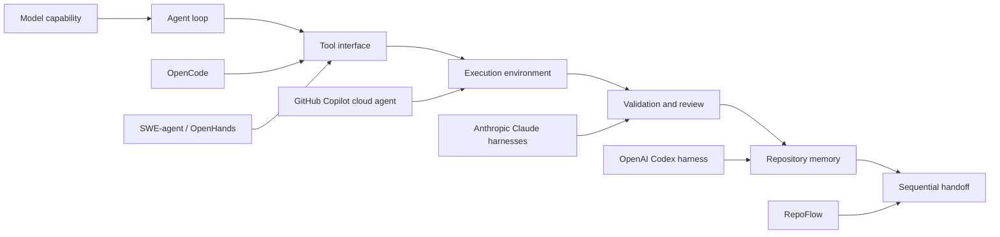

# Harness Landscape Review for RepoFlow

Date: 2026-07-03

This document reviews current industrial and academic work around coding-agent
harnesses, then evaluates whether RepoFlow has a defensible research and
engineering position.

The short answer is:

> RepoFlow should not claim to be a better coding agent than Codex, Claude Code,
> Copilot, OpenCode, SWE-agent, or OpenHands. Its defensible claim is narrower:
> a repository-level, model-agnostic scaffolding protocol for sequential
> handoff, context expansion, evidence capture, and deterministic gating across
> fresh agents.

That niche is real. Current systems have strong agent loops, tools, sandboxes,
review surfaces, and product integrations. They do not yet provide a compact,
open, benchmarkable protocol for making a repository itself the shared memory
and control surface across multiple independent coding agents.

## 1. Research Question

Can RepoFlow improve on existing harness work?

Only if "improve" is defined precisely.

RepoFlow is unlikely to beat frontier industrial systems on:

- model quality;
- IDE or terminal user experience;
- cloud task execution;
- platform integration;
- general autonomous coding throughput;
- long-running single-agent app generation.

RepoFlow can plausibly improve on existing work in:

- cross-agent sequential handoff;
- repository-local shared state;
- deterministic handoff and evidence schemas;
- explicit task activation and allowed-path boundaries;
- context packets that can be regenerated from repository state;
- evaluation of coordination failures, not only patch correctness;
- model-agnostic comparison across Codex, Claude Code, OpenCode, DeepSeek, and
  other agents.

The project should therefore position itself as a **repository-level
coordination scaffold** and **benchmark protocol**, not as a replacement coding
assistant or complete agent harness.

## 2. High-Level Landscape



The field is converging on the same lesson: agent performance is increasingly
determined by the surrounding harness. The harness includes instructions,
tools, permissions, retrieval, execution, verification, observability, memory,
and cleanup.

RepoFlow should stand at the far right of this chain: after a task has been
attempted, how does the repository preserve enough state for a different fresh
agent to continue safely?

## 3. Industrial Sources

### 3.1 OpenAI: Harness Engineering and Agent-Legible Repositories

Primary source:

- OpenAI, "Harness engineering: leveraging Codex in an agent-first world"
  <https://openai.com/index/harness-engineering/>

Relevant lessons:

- The core engineering shift is from humans writing every line to humans
  designing environments, feedback loops, and constraints.
- Repository knowledge becomes the system of record.
- A short `AGENTS.md` works best as a map, not as a giant manual.
- Long documents rot unless mechanically checked.
- Agent legibility matters: knowledge outside the repository is invisible to
  the agent.
- Architecture and taste should be enforced through custom linters, structural
  tests, and continuous cleanup.
- Full autonomy introduces entropy; recurring cleanup tasks become a kind of
  repository garbage collection.

How this supports RepoFlow:

- It validates our thesis that repository-local knowledge is not incidental; it
  is a central control surface for agentic development.
- It also warns us not to put everything in one file. RepoFlow needs indexed,
  task-conditioned context, not a huge instruction blob.

Gap left open:

- OpenAI describes a strong internal harness for an agent-generated codebase,
  but not an open protocol for sequential handoff across heterogeneous coding
  agents.

Design implication:

- `AGENTS.md` should be the table of contents.
- RepoFlow should maintain task graph, handoff, evidence, and context packets as
  separate checkable artifacts.

### 3.2 Martin Fowler: Outer Harness for Coding-Agent Users

Primary source:

- Martin Fowler, "Harness engineering for coding agent users"
  <https://martinfowler.com/articles/harness-engineering.html>

Relevant lessons:

- "Harness" can mean different layers around a model.
- Coding-agent users can build an outer harness around the agent's built-in
  harness.
- The user-level harness includes repository structure, rules, tests, docs, and
  operational discipline.

How this supports RepoFlow:

- RepoFlow is exactly an outer harness: it does not replace the model or client
  harness; it gives a repository a stable collaboration control layer.

Gap left open:

- The essay is conceptual and practice-oriented. It does not define a concrete
  file protocol or benchmark for handoff quality.

### 3.3 Anthropic: Effective Agents

Primary source:

- Anthropic, "Building Effective AI Agents"
  <https://www.anthropic.com/engineering/building-effective-agents>

Relevant lessons:

- Start with the simplest solution and add complexity only when needed.
- Distinguish workflows from agents:
  - workflows follow predefined code paths;
  - agents dynamically decide tool use.
- Common useful patterns include orchestrator-workers and
  evaluator-optimizer.
- Agents need ground truth from the environment, stopping conditions, and clear
  tools.

How this supports RepoFlow:

- RepoFlow should avoid becoming a heavy multi-agent framework.
- Its load-bearing complexity should be limited to state, evidence, boundaries,
  and context compilation.

Gap left open:

- The post describes patterns, not a repository-local handoff standard.

Design implication:

- RepoFlow should be an explicit workflow around otherwise autonomous agents.
  The agent can decide how to implement, but the harness controls what task is
  active, what evidence is required, and when the next task starts.

### 3.4 Anthropic: Context Engineering

Primary source:

- Anthropic, "Effective context engineering for AI agents"
  <https://www.anthropic.com/engineering/effective-context-engineering-for-ai-agents>

Relevant lessons:

- Prompt engineering is giving way to context engineering.
- Context is finite and must be curated.
- Just-in-time context retrieval can outperform loading everything upfront.
- File paths, names, folders, and timestamps are signals agents can use.

How this supports RepoFlow:

- RepoFlow's "repository context expansion" should not mean dumping the whole
  repository into a prompt.
- A context compiler should produce task-conditioned context packets with
  pointers, indexes, and required reads.

Gap left open:

- Context engineering guidance explains what to curate, but not how to preserve
  sequential multi-agent state in a repository.

### 3.5 Anthropic: Long-Running Agent Harnesses

Primary sources:

- Anthropic, "Effective harnesses for long-running agents"
  <https://www.anthropic.com/engineering/effective-harnesses-for-long-running-agents>
- Anthropic, "Harness design for long-running application development"
  <https://www.anthropic.com/engineering/harness-design-long-running-apps>

Relevant lessons:

- Long-running agents face the "new session has no memory" problem.
- Anthropic used an initializer agent plus coding agents that make incremental
  progress and leave artifacts for the next session.
- Useful artifacts include feature lists, progress files, git logs, setup
  scripts, and basic end-to-end tests.
- Context resets can be better than compaction when a session accumulates too
  much stale state, but resets require handoff artifacts rich enough for the
  next agent.
- More advanced harnesses use planner, generator, and evaluator roles.
- Sprint contracts help define "done" before implementation starts.
- Evaluator agents add value when the task is beyond what the generator can
  reliably self-check.

How this supports RepoFlow:

- This is the closest industrial precedent to RepoFlow.
- It validates sequential work, context reset, structured artifacts, and
  independent review.

Gap left open:

- Anthropic's approach is harness-specific and product-specific. RepoFlow can
  generalize the artifact protocol and make it benchmarkable across agents.

Design implication:

- RepoFlow should formalize:
  - task activation;
  - progress files as structured events;
  - handoff schemas;
  - evaluator or gate outputs;
  - replayable context packets.

### 3.6 Claude Code: Hooks, Skills, Subagents, Permissions

Primary sources:

- Claude Agent SDK overview:
  <https://code.claude.com/docs/en/agent-sdk/overview>
- Claude Code hooks:
  <https://code.claude.com/docs/en/hooks>
- Claude Code settings:
  <https://code.claude.com/docs/en/settings>
- Claude Code best practices:
  <https://code.claude.com/docs/en/best-practices>

Relevant lessons:

- Claude Code exposes built-in file, command, grep, glob, web, and question
  tools through its SDK.
- Hooks execute at lifecycle points and can deterministically run or block
  actions.
- Settings have managed, user, project, and local scopes.
- Skills encode domain knowledge and reusable workflows.
- Subagents run in separate contexts with their own tools.
- Best practices emphasize evidence: test output, commands, screenshots, and
  concrete verification rather than self-asserted success.

How this supports RepoFlow:

- Hooks and project settings are direct evidence that soft prompting is not
  enough; deterministic lifecycle controls matter.
- RepoFlow can be implemented on top of Claude Code, but it should remain
  client-agnostic.

Gap left open:

- Claude Code is a strong client harness. RepoFlow can provide a repository
  protocol that Claude Code, Codex, OpenCode, and other agents can all read.

### 3.7 OpenAI Codex: AGENTS.md, CLI, Cloud, Review

Primary sources:

- OpenAI Codex CLI GitHub repository:
  <https://github.com/openai/codex>
- OpenAI Codex AGENTS.md guide:
  <https://developers.openai.com/codex/guides/agents-md>
- OpenAI Codex GitHub code review:
  <https://developers.openai.com/codex/integrations/github>
- OpenAI Codex cloud:
  <https://developers.openai.com/codex/cloud>

Relevant lessons:

- Codex reads `AGENTS.md` before work and layers global and project guidance.
- Codex CLI is an open-source local terminal coding agent.
- Codex code review follows repository guidance and focuses on high-priority
  risks.
- Codex cloud can connect to GitHub and create pull requests.

How this supports RepoFlow:

- `AGENTS.md` is now a common cross-tool entry point.
- RepoFlow can use `AGENTS.md` as the entry map while keeping dynamic state in
  structured files.

Gap left open:

- Codex instructions provide guidance, but do not by themselves define task
  graph state, handoff evidence, allowed-path gating, or multi-agent lifecycle
  scoring.

### 3.8 GitHub Copilot Cloud Agent

Primary sources:

- GitHub Docs, "About GitHub Copilot cloud agent"
  <https://docs.github.com/en/copilot/concepts/agents/cloud-agent/about-cloud-agent>
- GitHub Blog, "GitHub Copilot: Meet the new coding agent"
  <https://github.blog/news-insights/product-news/github-copilot-meet-the-new-coding-agent/>
- VS Code Docs, "Cloud agents in Visual Studio Code"
  <https://code.visualstudio.com/docs/agents/agent-types/cloud-agents>

Relevant lessons:

- Copilot cloud agent runs in an ephemeral GitHub Actions environment.
- It can research, plan, change code on a branch, push commits, open pull
  requests, and iterate from comments.
- GitHub emphasizes logs, draft PRs, branch protections, restricted internet
  access, human approval, metrics, custom instructions, memory, MCP, custom
  agents, and hooks.
- GitHub's main state carrier is the GitHub platform: issues, branches, PRs,
  logs, discussions, and metrics.

How this supports RepoFlow:

- GitHub validates the PR-centric control plane: observable commits, logs, and
  human review are part of the harness.
- It also validates the need for transparency across the team.

Gap left open:

- Copilot's coordination state is platform-bound. RepoFlow should work in a
  plain Git repository and in temporary local workspaces, not only GitHub.
- Copilot is optimized for PR lifecycle. RepoFlow is optimized for sequential
  agent handoff and benchmarkable coordination discipline.

### 3.9 OpenCode

Primary sources:

- OpenCode docs:
  <https://opencode.ai/docs/>
- OpenCode agents docs:
  <https://opencode.ai/docs/agents/>
- OpenCode GitHub repository:
  <https://github.com/sst/opencode>

Relevant lessons:

- OpenCode is an open-source coding agent for terminal, IDE, and desktop.
- It supports multiple providers, plan/build modes, subagents, LSP integration,
  permissions, custom agents, MCP servers, and project initialization.
- Its plan agent is restricted and read-oriented, while build mode has fuller
  tool access.
- Permissions can gate read, edit, bash, external-directory access, web search,
  LSP, skills, and task invocation.

How this supports RepoFlow:

- OpenCode is a good substrate for mixed-agent experiments because it is open
  and model-provider agnostic.
- Its permission model reinforces the need to separate planning, reading,
  editing, and external access.

Gap left open:

- OpenCode configures agent behavior, but does not define a cross-client
  repository state protocol for task handoff and evidence scoring.

## 4. Academic and Open-Source Research

### 4.1 ReAct

Source:

- Yao et al., "ReAct: Synergizing Reasoning and Acting in Language Models"
  <https://arxiv.org/abs/2210.03629>

Lesson:

- Agent traces that interleave reasoning and actions can improve task solving
  and interpretability.

RepoFlow relevance:

- RepoFlow should not try to record private chain-of-thought. But it should
  record observable action traces: commands, diffs, tests, and decisions.

### 4.2 Toolformer

Source:

- Schick et al., "Toolformer: Language Models Can Teach Themselves to Use
  Tools" <https://arxiv.org/abs/2302.04761>

Lesson:

- Tool use is a central way to extend language models beyond raw text
  generation.

RepoFlow relevance:

- RepoFlow should treat context building, gate checking, scope checking, and
  evidence rendering as tools.

### 4.3 Reflexion

Source:

- Shinn et al., "Reflexion: Language Agents with Verbal Reinforcement Learning"
  <https://arxiv.org/abs/2303.11366>

Lesson:

- Agents can improve across attempts by storing textual feedback and episodic
  memory.

RepoFlow relevance:

- RepoFlow's handoff and review records are a repository-level version of
  durable textual feedback, but grounded in observable repository state.

### 4.4 AutoGen

Source:

- Wu et al., "AutoGen: Enabling Next-Gen LLM Applications via Multi-Agent
  Conversation" <https://arxiv.org/abs/2308.08155>

Lesson:

- Multi-agent systems can be programmed through configurable agent
  conversations and tool use.

RepoFlow relevance:

- RepoFlow differs by avoiding dependence on a live inter-agent conversation.
  Its communication channel is the repository itself.

### 4.5 SWE-agent and Agent-Computer Interfaces

Sources:

- Yang et al., "Agent-Computer Interfaces Enable Automated Software
  Engineering" <https://arxiv.org/abs/2405.15793>
- SWE-agent GitHub repository:
  <https://github.com/swe-agent/swe-agent>

Lesson:

- Interface design strongly affects coding-agent performance.
- Custom commands and repository navigation tools can improve software
  engineering agents.

RepoFlow relevance:

- RepoFlow can be seen as an agent-computer interface specialized for handoff
  state rather than only code navigation and editing.

### 4.6 OpenHands

Sources:

- Wang et al., "OpenHands: An Open Platform for AI Software Developers as
  Generalist Agents" <https://arxiv.org/abs/2407.16741>
- OpenHands Software Agent SDK paper:
  <https://arxiv.org/html/2511.03690v1>

Lesson:

- OpenHands provides sandboxed execution, event-driven architecture, agent
  development infrastructure, and benchmark integration.

RepoFlow relevance:

- OpenHands is a broad platform for building agents. RepoFlow is narrower: it
  can provide a repository-state protocol that could be used inside OpenHands
  or compared against it.

### 4.7 Agentless

Source:

- Xia et al., "Agentless: Demystifying LLM-based Software Engineering Agents"
  <https://arxiv.org/abs/2407.01489>

Lesson:

- Simple structured workflows can beat more complex agents on some software
  engineering benchmarks.
- Complexity must justify itself through ablation.

RepoFlow relevance:

- RepoFlow must include ablations:
  - no-board;
  - handoff-only;
  - board-only;
  - full-board;
  - repo-expanded context.
- We should not assume a more complex protocol is better without evidence.

### 4.8 SWE-bench and SWE-bench Verified

Sources:

- SWE-bench GitHub repository:
  <https://github.com/swe-bench/SWE-bench>
- OpenAI, "Introducing SWE-bench Verified"
  <https://openai.com/index/introducing-swe-bench-verified/>
- SWE-Bench Pro:
  <https://arxiv.org/abs/2509.16941>

Lesson:

- Software-agent evaluation has moved toward real repositories and real
  issue-derived tasks.
- Human validation and long-horizon task design matter.

RepoFlow relevance:

- RepoFlow should not compete directly with SWE-bench on patch correctness.
  It should measure handoff continuity, scope discipline, evidence quality, and
  state recoverability.

### 4.9 Emerging Repository-Structure Work

Sources:

- "LLM Agents Can See Code Repositories"
  <https://arxiv.org/html/2606.14061v1>
- "Same Signal, Different Semantics: A Cross-Framework Behavioral Analysis of
  Software Engineering Agents" <https://arxiv.org/abs/2605.18332>
- "Observability-Driven Automatic Evolution of Coding-Agent Harnesses"
  <https://arxiv.org/pdf/2604.25850>

Lesson:

- The field is beginning to study repository graphs, cross-framework behavior,
  and harness evolution itself.

RepoFlow relevance:

- This strengthens the case that harnesses are becoming research objects, not
  just product plumbing.
- RepoFlow can add the missing handoff-state dimension.

## 5. Comparison Matrix

| System or line of work | Main strength | State carrier | Control mechanism | Gap RepoFlow targets |
| --- | --- | --- | --- | --- |
| OpenAI Codex harness | Agent-legible repository, observability, architecture enforcement | Structured docs, code, CI, lints | Agent runs, tests, custom tooling | Not an open sequential handoff benchmark |
| Anthropic long-running harness | Context resets, planner/generator/evaluator, structured artifacts | Feature lists, progress files, contracts | Agent SDK, evaluator feedback | Product-specific, not cross-agent protocol |
| Claude Code | Strong client harness with hooks, skills, subagents, permissions | CLAUDE.md, settings, memory, session context | Hooks, tools, permissions | Client-specific; state not standardized across tools |
| Codex CLI | Open-source local coding agent, AGENTS.md guidance | AGENTS.md, repo files, session | Sandbox, approvals, CLI tools | Guidance but not full handoff/evidence protocol |
| GitHub Copilot cloud agent | PR-native cloud execution and team visibility | Issues, branches, PRs, logs, memory | GitHub Actions, branch rules, human review | Platform-bound; less focused on local benchmark handoff |
| OpenCode | Open model-provider-agnostic coding client | AGENTS.md, opencode config, session state | Plan/build modes, permissions, subagents | Client harness, not repo-local evaluation protocol |
| SWE-agent | Agent-computer interface for coding tasks | Issue, repo, tool trajectory | ACI, commands, tests | Mostly single-task patch solving |
| OpenHands | General software-agent platform | Event stream, sandbox, workspace | Platform orchestration | Broad agent platform, not specific repo handoff standard |
| Agentless | Simple interpretable baseline | Localization, repair, validation steps | Fixed workflow | Warns RepoFlow to prove each component |
| SWE-bench | Real-world issue benchmark | GitHub issue and repository | Test-based scoring | Patch correctness more than collaboration continuity |
| RepoFlow | Cross-agent sequential shared state | Task graph, handoff, evidence, context packet | Activation, scope, gate, context compiler | Needs stronger implementation and ablations |

## 6. What Is Actually New in RepoFlow?

RepoFlow should not claim novelty for:

- using agents to code;
- using tools;
- using `AGENTS.md` or repository instructions;
- using tests and CI;
- using planner/evaluator roles;
- using handoff notes in general;
- using a task board in general.

RepoFlow can plausibly claim novelty or at least a useful synthesis in:

1. **Repository-local handoff protocol**
   - The repository itself carries task, status, evidence, and risk state.
   - Handoff is structured and schema-checked.

2. **Fresh-agent recoverability**
   - A new agent with no memory must recover the state from files and evidence.

3. **Task-conditioned context expansion**
  - The repository scaffold compiles a bounded context packet from repository state.
   - This is stronger than a static instruction file and more reproducible than
     an ad-hoc prompt.

4. **Sequential multi-agent benchmark**
   - The evaluation target is continuity across agents, not only final patch
     correctness.

5. **Authority separation**
   - Agents can read workspace mirrors, but acceptance authority stays outside
     the mutable workspace.

6. **Coordination metrics**
   - Measure missing handoffs, out-of-scope edits, invalid evidence, repeated
     work, stale status, and downstream failure to reuse upstream decisions.

This is a real niche. It is narrower than "build the best coding agent", but
more scientifically defensible.

For a stricter claim ladder, falsifiable hypotheses, and token-budget testing
protocol, see `docs/REPOFLOW_RIGOROUS_EVALUATION_PLAN.md`.

## 7. Risks to the RepoFlow Thesis

### Risk 1: Existing harnesses may absorb the idea

Codex, Claude Code, Copilot, and OpenCode already support instructions, memory,
hooks, skills, and custom agents. They could add first-class handoff protocols.

Mitigation:

- Keep RepoFlow open, file-based, and cross-client.
- Emphasize benchmarkability and model-agnostic comparison.

### Risk 2: The protocol may be too heavy

Agentless and Anthropic's "start simple" guidance warn against unnecessary
complexity.

Mitigation:

- Add ablations.
- Make each component independently measurable.
- Keep `AGENTS.md` short and use context packets instead of large manuals.

### Risk 3: Agents may mechanically fill forms without understanding

An agent can write a plausible handoff while ignoring the actual state.

Mitigation:

- Bind handoff claims to observable evidence:
  - commands;
  - exit codes;
  - changed files;
  - diff;
  - gate results.

### Risk 4: Repository state can rot

OpenAI's harness engineering post strongly warns that documentation decays.

Mitigation:

- Add freshness checks.
- Add index files.
- Add recurring cleanup tasks.
- Promote repeated textual rules into deterministic checks.

### Risk 5: Sequential handoff may be less important than one strong agent

As models improve, a single agent may handle longer tasks.

Mitigation:

- Position RepoFlow as useful for:
  - context resets;
  - auditability;
  - model switching;
  - asynchronous teams;
  - external review;
  - benchmark reproducibility.

## 8. Design Principles Confirmed by the Literature

1. **Use a map, not a monolith**
   - `AGENTS.md` should point to structured state, not contain all state.

2. **Make context task-conditioned**
   - Build context packets per task instead of dumping everything.

3. **Separate readable state from trusted authority**
   - Agents can read workspace state, but gates and oracles must be external or
     deterministic.

4. **Encode invariants mechanically**
   - If a rule matters repeatedly, move it from prose into a checker.

5. **Keep evidence concrete**
   - Record command, exit code, test output, changed files, and risk.

6. **Treat handoff as an interface**
   - A handoff should preserve produced interfaces, consumed interfaces, and
     unresolved risk.

7. **Ablate aggressively**
   - If a board, handoff, context compiler, or reviewer does not improve
     outcomes, simplify it.

8. **Design for mixed clients**
   - Codex, Claude Code, OpenCode, and Copilot each have their own harness.
     RepoFlow should live at the repository layer.

## 9. Recommended RepoFlow V2 Adjustments

The current V2 design should be sharpened in four ways.

### 9.1 Rename the core contribution

Use:

> repository-local context-expansion and handoff protocol

Avoid:

> a better coding agent

### 9.2 Add a context compiler prototype

Minimum command:

```bash
PYTHONPATH=. python3 scripts/build_context.py --repo <workspace> --task-id <task>
```

Minimum output:

```text
.repo_manager/agent_context.md
.repo_manager/agent_context_index.json
```

The compiler should read:

- `AGENTS.md`;
- `AI_CONTRACT.md`;
- `PROJECT_BOARD.md`;
- `.board/tasks.yaml`;
- latest relevant handoff;
- changed-file summary;
- allowed paths;
- acceptance commands.

### 9.3 Add repo-expanded benchmark condition

Add:

```text
repo_expanded_context
```

Compare:

- no-board;
- native instructions;
- native docs handoff;
- full boardflow;
- repo-expanded context.

### 9.4 Make handoff claims auditable

Every handoff validation claim should be linkable to:

- command record;
- exit code;
- test output;
- diff or changed files;
- gate result.

## 10. Claims We Can Make

Safe claim:

> Existing coding-agent systems increasingly rely on harness design, including
> repository instructions, tool permissions, context curation, hooks, validation,
> and evaluator loops. RepoFlow builds on this trend by focusing on a narrower
> problem: how a repository can carry structured state for sequential handoff
> among fresh coding agents.

Stronger but still defensible claim:

> RepoFlow treats repository state as a recoverable context representation. It
> turns handoff from an informal note into a schema-checked, evidence-bound
> interface between agents.

Claim that needs experiments:

> RepoFlow reduces context loss, scope drift, and evidence gaps compared with
> ordinary README-only or natural-language handoff baselines.

Claim to avoid:

> RepoFlow is better than Codex, Claude Code, Copilot, OpenCode, SWE-agent, or
> OpenHands.

Better wording:

> RepoFlow is complementary to those systems and can run above them as a
> repository-layer harness.

## 11. Next Work Items

1. Update `docs/REPOFLOW_V2_DESIGN.md` to cite this landscape review.
2. Implement the context compiler prototype.
3. Add `repo_expanded_context` as a scenario condition.
4. Add tests that compare the generated context packet across repeated runs.
5. Design ablations that isolate:
   - task graph only;
   - handoff only;
   - handoff plus evidence;
   - compiled context packet;
   - compiled context plus deterministic gate.

## 12. Source List

Industrial and product sources:

- OpenAI harness engineering:
  <https://openai.com/index/harness-engineering/>
- Martin Fowler harness engineering:
  <https://martinfowler.com/articles/harness-engineering.html>
- Anthropic effective agents:
  <https://www.anthropic.com/engineering/building-effective-agents>
- Anthropic context engineering:
  <https://www.anthropic.com/engineering/effective-context-engineering-for-ai-agents>
- Anthropic long-running agents:
  <https://www.anthropic.com/engineering/effective-harnesses-for-long-running-agents>
- Anthropic long-running application harness:
  <https://www.anthropic.com/engineering/harness-design-long-running-apps>
- Claude Agent SDK:
  <https://code.claude.com/docs/en/agent-sdk/overview>
- Claude Code hooks:
  <https://code.claude.com/docs/en/hooks>
- Claude Code best practices:
  <https://code.claude.com/docs/en/best-practices>
- OpenAI Codex CLI:
  <https://github.com/openai/codex>
- OpenAI Codex AGENTS.md guide:
  <https://developers.openai.com/codex/guides/agents-md>
- OpenAI Codex GitHub review:
  <https://developers.openai.com/codex/integrations/github>
- GitHub Copilot cloud agent:
  <https://docs.github.com/en/copilot/concepts/agents/cloud-agent/about-cloud-agent>
- GitHub Copilot coding agent announcement:
  <https://github.blog/news-insights/product-news/github-copilot-meet-the-new-coding-agent/>
- OpenCode docs:
  <https://opencode.ai/docs/>
- OpenCode agents:
  <https://opencode.ai/docs/agents/>
- OpenCode GitHub repository:
  <https://github.com/sst/opencode>

Academic and open-source sources:

- ReAct:
  <https://arxiv.org/abs/2210.03629>
- Toolformer:
  <https://arxiv.org/abs/2302.04761>
- Reflexion:
  <https://arxiv.org/abs/2303.11366>
- AutoGen:
  <https://arxiv.org/abs/2308.08155>
- SWE-agent:
  <https://arxiv.org/abs/2405.15793>
- SWE-agent GitHub:
  <https://github.com/swe-agent/swe-agent>
- OpenHands:
  <https://arxiv.org/abs/2407.16741>
- OpenHands SDK:
  <https://arxiv.org/html/2511.03690v1>
- Agentless:
  <https://arxiv.org/abs/2407.01489>
- SWE-bench:
  <https://github.com/swe-bench/SWE-bench>
- SWE-bench Verified:
  <https://openai.com/index/introducing-swe-bench-verified/>
- SWE-Bench Pro:
  <https://arxiv.org/abs/2509.16941>
- Repository graph context for agents:
  <https://arxiv.org/html/2606.14061v1>
- Cross-framework software-agent behavior:
  <https://arxiv.org/abs/2605.18332>
- Observability-driven harness evolution:
  <https://arxiv.org/pdf/2604.25850>
