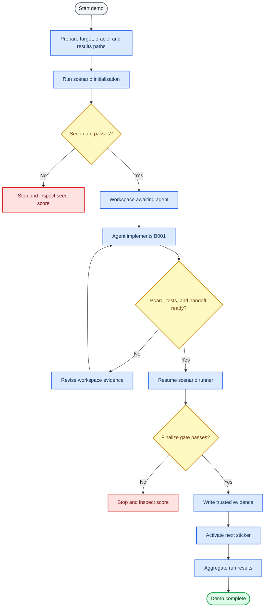
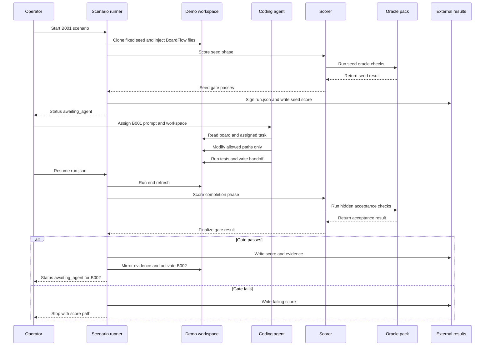

# Tonight B001 demo workflow

_BoardFlowBench one-task demo runbook and lifecycle map for the Expense Lite B001 task._

---

## Goal

Tonight's demo should show one complete BoardFlowBench loop:

1. Start from the fixed Expense Lite seed.
2. Expose only task `B001` to the coding agent.
3. Let the agent fix one visible failing task inside the standalone demo workspace.
4. Require board, tests, and handoff evidence.
5. Resume the runner so the deterministic gate scores the result and activates the next sticker.

The demo is intentionally narrow. It should prove the workflow, not finish all B001-B004 tasks.

## Demo state

The local one-task demo was verified on 2026-06-03:

| Item | Value |
| --- | --- |
| Workspace | `/tmp/boardflowbench-runs/tonight-b001-demo` |
| Results root | `/tmp/boardflowbench-results-tonight-b001` |
| Run manifest | `/tmp/boardflowbench-results-tonight-b001/expense_lite-full_boardflow-1780494452940753000/run.json` |
| Condition | `full_boardflow` |
| Completed stage | `B001` |
| Current task after activation | `B002` |
| Runner status after B001 | `awaiting_agent` |
| B001 score | `110 / 110` |
| B001 normalized score | `100.0` |
| B001 gate | `PASS` |
| Aggregated task pass rate | `1.0` |
| Seed commit | `30ce6f0d76e2338e56d599fd2beb6fe954b96452` |
| Oracle commit | `03a6bbcd0703587addc043cdfee54fb0be704702` |
| Summary | `/tmp/boardflowbench-results-tonight-b001/summary.json` |

Before the B001 fix, the visible parser test failed as expected:

```bash
cd /tmp/boardflowbench-runs/tonight-b001-demo
PYTHONDONTWRITEBYTECODE=1 PYTHONPATH=src python3 -m unittest discover -s tests -p 'test_parser.py'
```

Expected initial failure:

- `test_normalize_accepts_slash_date`
- `test_normalize_strips_whitespace_from_slash_date`

After the B001 fix and runner resume:

| Check | Result |
| --- | --- |
| Parser acceptance tests | PASS, 5 tests |
| Validator regression tests | PASS, 3 tests |
| Private B001 oracle | PASS, 2 tests |
| Scope drift | 0 violations |
| Hygiene | 0 violations |
| Handoff | 0 violations |
| Board consistency | 0 violations |
| Reviewer risks | 0 |

After B001 passes, the runner immediately activates B002 and runs the next start refresh. A run-local change to `.repo_manager/agent_context.md` at that point belongs to the B002 handoff context, not to B001 acceptance.

## Runbook

Use these commands from the BoardFlowBench repository root.

### Initialize or reset the demo

```bash
rm -rf /tmp/boardflowbench-runs/tonight-b001-demo
rm -rf /tmp/boardflowbench-results-tonight-b001

PYTHONDONTWRITEBYTECODE=1 PYTHONPATH=. python3 scripts/run_scenario.py \
  --target expense_lite \
  --condition full_boardflow \
  --workspace /tmp/boardflowbench-runs/tonight-b001-demo \
  --oracle-root ../ExpenseLiteBenchOracles \
  --results-dir /tmp/boardflowbench-results-tonight-b001 \
  --source-repo ../ExpenseLiteBenchDemo
```

The runner should stop with:

```text
"current_task": "B001"
"status": "awaiting_agent"
```

### Give the task to the coding agent

Open the demo workspace:

```bash
cd /tmp/boardflowbench-runs/tonight-b001-demo
```

Give the agent this prompt:

```text
You are inside an initialized BoardFlowBench demo workspace.

Read in order:
1. AGENTS.md
2. AI_CONTRACT.md
3. PROJECT_BOARD.md
4. .board/tasks.yaml
5. .board/assigned_task.yaml

Implement only task B001. Stay inside allowed_paths. First confirm the expected failing parser test, then fix the parser, run the acceptance and regression commands, update the board, and write a complete JSON handoff under .board/handoffs/.
```

The agent should normally touch only:

| Path | Purpose |
| --- | --- |
| `src/expense_lite/parser.py` | B001 implementation |
| `tests/test_parser.py` | Only if test expectations need clarification |
| `PROJECT_BOARD.md` | Status mirror |
| `.board/tasks.yaml` | Machine board state |
| `.board/handoffs/` | Required structured handoff |

### Resume deterministic acceptance

After the agent finishes and the workspace is clean enough for scoring:

```bash
PYTHONDONTWRITEBYTECODE=1 PYTHONPATH=. python3 scripts/run_scenario.py \
  --resume /tmp/boardflowbench-results-tonight-b001/expense_lite-full_boardflow-1780494452940753000/run.json
```

If B001 passes, the runner writes external evidence and activates `B002`. If it fails, inspect:

```bash
find /tmp/boardflowbench-results-tonight-b001 -maxdepth 4 -type f | sort
```

### Aggregate after the demo

```bash
PYTHONDONTWRITEBYTECODE=1 PYTHONPATH=. python3 scripts/aggregate_benchmark_results.py \
  --results-dir /tmp/boardflowbench-results-tonight-b001 \
  --output /tmp/boardflowbench-results-tonight-b001/summary.json
```

## Full workflow map



## Actor sequence



## Artifact map

| Artifact | Location | Authority |
| --- | --- | --- |
| Demo code | `/tmp/boardflowbench-runs/tonight-b001-demo` | Agent may modify allowed paths |
| Workspace board | `PROJECT_BOARD.md`, `.board/tasks.yaml` | Readable working state |
| Assigned task | `.board/assigned_task.yaml` | Current visible sticker detail |
| Handoff | `.board/handoffs/*.json` | Required workspace evidence |
| Run manifest | `/tmp/boardflowbench-results-tonight-b001/<run-id>/run.json` | Trusted signed control-plane state |
| Seed score | `/tmp/boardflowbench-results-tonight-b001/<run-id>/seed-score.json` | Trusted external result |
| Completion score | `/tmp/boardflowbench-results-tonight-b001/<run-id>/stages/B001/score.json` | Trusted external result |
| Completion evidence | `/tmp/boardflowbench-results-tonight-b001/<run-id>/stages/B001/evidence.json` | Trusted external result |
| Workspace evidence mirror | `.board/evidence/B001.json` | Readable mirror only |
| Oracle pack | `../ExpenseLiteBenchOracles` | External hidden acceptance tests |

## Demo checklist

- [ ] Sibling repositories exist: `../ExpenseLiteBenchDemo` and `../ExpenseLiteBenchOracles`
- [ ] Oracle repository is clean and at `03a6bbcd0703587addc043cdfee54fb0be704702`
- [ ] `run_scenario.py` initializes B001 and stops at `awaiting_agent`
- [ ] Initial parser test fails on slash dates
- [ ] Agent reads injected BoardFlow files before editing
- [ ] Agent stays inside `allowed_paths`
- [ ] Acceptance and regression commands pass
- [ ] Agent writes a non-empty JSON handoff with real PASS command and test records
- [ ] `run_scenario.py --resume <run.json>` writes trusted evidence
- [ ] Runner activates B002 after B001 passes
- [ ] Aggregation produces `summary.json`

## What this demo proves

This one-task demo is enough to show the core loop:

- BoardFlowBench can create a standalone, fixed-seed demo workspace.
- The agent sees a scoped sticker, not the future task answers.
- The taskboard and handoff provide repo-local continuity.
- The scorer checks correctness, scope, hygiene, handoff, and board consistency.
- Trusted evidence lives outside the agent workspace.
- The next sticker activates only after deterministic acceptance.

## Classroom comparison record: B001-B002

The classroom comparison run used two isolated workspaces from the same fixed seed and the same startup prompt text.

| Item | Full BoardFlow | No-board baseline |
| --- | --- | --- |
| Workspace | `/tmp/boardflowbench-class-full-20260603-222648/workspace` | `/tmp/boardflowbench-class-noboard-20260603-222648/workspace` |
| Run manifest | `/tmp/boardflowbench-class-results-20260603-222648/expense_lite-full_boardflow-1780496825736367000/run.json` | `/tmp/boardflowbench-class-results-20260603-222648/expense_lite-no_board_baseline-1780496834384990000/run.json` |
| Current task after B002 | `B003` | `B003` |
| Runner status | `awaiting_agent` | `awaiting_agent` |
| Accepted stages | `B001`, `B002` | `B001`, `B002` |
| Aggregated pass rate | `1.0` | `1.0` |
| Scope drift | `0` | `0` |
| Hygiene violations | `0` | `0` |
| Reviewer risks | `0` | `0` |

### B002 agent behavior

| Behavior | Full BoardFlow | No-board baseline |
| --- | --- | --- |
| Baseline checks before editing | Ran parser and validator tests; both passed | Ran parser and validator tests; both passed |
| Main implementation | Added `load_expenses_csv()` to `src/expense_lite/parser.py` using `csv.DictReader` | Added `load_expenses_csv()` to `src/expense_lite/parser.py` using `csv.DictReader` |
| Validation reuse | Converted CSV `amount` to `float`, then delegated each row to `validate_expense()` | Converted CSV `amount` to `float`, then delegated each row to `validate_expense()` |
| Missing-column handling | Raises `ValueError` with missing CSV column names | Raises `ValueError` with missing CSV column names |
| Added tests | 3 parser tests: valid CSV, missing columns, malformed amount | 2 parser tests: valid CSV, missing columns |
| Board update | Updated `B002` to `READY_FOR_REVIEW`, owner `claude` | No board files present, no board update |
| Handoff | Wrote `.board/handoffs/B002_claude_20260603.json` | No handoff created |
| Final visible tests | 11 tests passed | 10 tests passed |

The two agents independently produced the same core implementation shape. The BoardFlow condition additionally produced structured state changes and a handoff; the no-board condition stayed limited to code and tests.

### B002 gate results

| Metric | Full BoardFlow | No-board baseline |
| --- | ---: | ---: |
| Normalized score | `100.0` | `100.0` |
| Hard gate | `PASS` | `PASS` |
| Correctness score | `20 / 20` | `20 / 20` |
| Scope score | `15 / 15` | `15 / 15` |
| Hygiene score | `20 / 20` | `20 / 20` |
| Handoff score | `15 / 15` | not applicable |
| Board consistency score | `10 / 10` | not applicable |
| Total applicable score | `80 / 80` | `55 / 55` |

External score files:

| Condition | Score file |
| --- | --- |
| Full BoardFlow | `/tmp/boardflowbench-class-results-20260603-222648/expense_lite-full_boardflow-1780496825736367000/stages/B002/score.json` |
| No-board baseline | `/tmp/boardflowbench-class-results-20260603-222648/expense_lite-no_board_baseline-1780496834384990000/stages/B002/score.json` |

Aggregated summary:

```text
/tmp/boardflowbench-class-results-20260603-222648/summary.json
```

The important classroom interpretation is that B002 did not separate the conditions by raw correctness. Both passed. It did separate the workflow artifacts: the BoardFlow run carried forward board state, dependency context, and a structured handoff into the next task, while the no-board run had no repo-local transition record.
